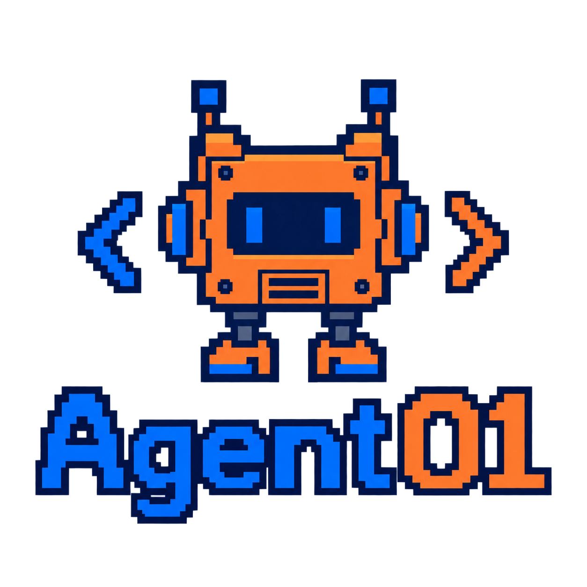

<p align="center">
  
</p>

<h1 align="center">Agent01 · From Scratch</h1>

<p align="center">逐文件阅读、重建一个 Agent，理解从工具调用到任务规划、执行与验证的完整过程。</p>

## 关于项目

Agent01 是我的 Agent 开发学习仓库，参考 MokioClaw 项目逐步重建，并在代码中记录理解与注释。“From Scratch”指从基础模块开始学习和组装，项目使用 LangChain、LangGraph 等现有框架。

**当前阶段：第二阶段——基于 LangGraph 的 Plan & Execute 工作流。**

第一阶段通过 `create_agent()` 组装单个 Agent；第二阶段显式拆分规划、执行、验证和汇总，并加入 Todo 管理与失败重试。第一阶段的说明保存在 [README_stage1.md](README_stage1.md)。本阶段参考原项目提交 `897372d`。

## 工作流

```text
用户任务
   ↓
planner：调用模型生成计划、Todo、验收标准与验证命令
   ↓
actor：调用模型与工具实施计划、更新 Todo
   ↓
verifier：执行验证命令，收集退出码与输出
   ├─ 未通过且还有尝试次数 → planner（带上失败信息）
   └─ 通过或达到尝试上限 → final：汇总结果 → 结束
```

| 节点 | 实现方式 | 主要产出 |
| --- | --- | --- |
| `planner` | 模型返回 JSON，程序解析并补充默认字段 | 计划摘要、待办、验收标准、验证命令 |
| `actor` | 绑定工具，手动循环执行模型提出的工具调用 | 文件与命令执行结果、Todo 状态、执行摘要 |
| `verifier` | Python 直接运行验证命令，不调用模型 | 验证结果、是否通过、失败信息、尝试次数 |
| `final` | Python 拼接报告，不调用模型 | 最终计划、Todo、验证结果和执行摘要 |

默认最多尝试 3 轮，验证通过后提前结束。这个次数限制的是规划、执行、验证的完整轮次；actor 每轮另外限制最多 10 次模型调用，不代表只能执行 10 个工具。

## 如何运行

以下示例使用 Windows PowerShell，在项目根目录执行。需要 uv，项目声明 Python 3.13 或以上版本，`.python-version` 指定 3.13。

### 1. 安装依赖

```powershell
uv sync
```

uv 根据 `pyproject.toml` 和 `uv.lock` 准备项目环境。使用 `uv run` 时不需要手动激活 `.venv`。

### 2. 配置模型

首次使用时复制配置模板；已有 `.env` 时直接编辑，不要覆盖：

```powershell
Copy-Item .env.example .env
```

填写三个必需配置项：

```dotenv
API_KEY=你的API密钥
MODEL=你的模型名称
BASE_URL=你的模型服务API基础地址
```

项目使用 `ChatOpenAI` 创建模型客户端，需要兼容的服务接口和支持工具调用的模型。`BASE_URL` 是 API 基础地址，不是聊天网页地址。真实密钥保存在本地 `.env`，该文件已被 Git 忽略。

### 3. 查看帮助

```powershell
uv run Agent01 --help
```

不提供任务时也会显示帮助，不会调用模型。

### 4. 执行任务

先尝试一个包含明确验证要求的小任务：

```powershell
uv run Agent01 "创建 hello.py，输出 Hello, Agent01!，并添加 test_hello.py 使用 pytest 验证输出。" --max-attempts 3
```

本阶段还保留了原项目的康威生命游戏演示：

```powershell
uv run Agent01 "帮我用 TDD 开发一个终端版康威生命游戏，包含规则测试和非交互演示。"
```

默认工作区为项目根目录下的 `.Agent01/workspace/`，运行时自动创建，多个任务会重复使用该目录。可通过参数为任务指定独立目录：

```powershell
uv run Agent01 "创建一个计算器模块及对应的 pytest 测试。" --workspace ./demo-workspace --max-attempts 2
```

| 参数 | 默认值 | 作用 |
| --- | --- | --- |
| `TASK` | 无 | 自然语言任务 |
| `--workspace` / `-w` | `.Agent01/workspace/` | 工具操作与生成文件的工作区 |
| `--max-attempts` | `3` | 验证失败时允许的最大尝试轮数 |

以下两种方式也进入相同的 CLI：

```powershell
uv run main.py "你的任务"
uv run python -m Agent01 "你的任务"
```

## 状态与事件

项目有两层状态，职责不同：

- `RuntimeState`：保存工作区路径、文件读取记录和快照，供文件及命令工具使用。
- `Agent01GraphState`：保存任务、消息、计划、Todo、验证结果与重试次数，其中 `runtime` 字段引用 `RuntimeState`。

节点返回需要更新的字段，由 LangGraph 合并进运行中的图状态。`messages` 使用 `add_messages` 合并；其他未指定特殊规则的字段使用新的值更新。当前没有配置 checkpoint 持久化，图状态在本次运行期间维护；生成的文件则保留在工作区。

CLI 展示来自两类事件：

| 流模式 | 来源 | 用途 |
| --- | --- | --- |
| `updates` | 节点返回的状态更新 | 展示计划、执行摘要、验证结果和最终报告 |
| `custom` | 节点通过 `get_stream_writer()` 取得的函数发送事件 | 展示计划快照、工具调用、工具结果和 Todo 更新 |

`core/agent.py` 转发事件，`cli/app.py` 接收事件，`cli/formatter.py` 使用 Rich 面板和表格显示。事件发送本身不会执行工具，也不会自动修改 Todo。

## 工具

| 工具 | 功能 |
| --- | --- |
| `FileReadTool` | 读取工作区文本，支持按行截取 |
| `FileWriteTool` | 创建文件或整体覆盖已有文件 |
| `FileEditTool` | 匹配旧文本并做局部替换 |
| `GrepTool` | 按正则表达式搜索文件内容 |
| `BashTool` | 执行开发命令，返回退出码、输出和超时信息 |
| `TodoUpdateTool` | 根据 ID 更新待办的状态与备注 |

通用工具在 `tools/registry.py` 注册；`TodoUpdateTool` 在 `graph/nodes.py` 中绑定当前待办列表后加入 actor。`tools/todo_tool.py` 提供数据规范化和更新逻辑，本阶段不会将 Todo 自动保存为 `TODO.md`。

## 代码结构与阅读顺序

```text
Agent01-from-Scratch/
├─ src/Agent01/
│  ├─ graph/
│  │  ├─ state.py          # 图状态结构与消息合并规则
│  │  ├─ workflow.py       # 注册节点、连接顺序和重试分支
│  │  └─ nodes.py          # 规划、执行、验证、路由与汇总
│  ├─ core/
│  │  ├─ agent.py          # 准备初始状态，启动图并转发事件
│  │  ├─ paths.py          # 项目根目录和工作区路径
│  │  └─ state.py          # RuntimeState 与文件快照
│  ├─ tools/
│  │  ├─ registry.py       # 通用工具注册
│  │  ├─ todo_tool.py      # Todo 数据整理与状态更新
│  │  ├─ file_tools.py     # 读、写、编辑文件
│  │  ├─ grep_tool.py      # 搜索文件内容
│  │  └─ bash_tool.py      # 执行命令与处理输出
│  ├─ prompts/
│  │  ├─ version1.py       # 保留的第一阶段提示词
│  │  └─ version2.py       # 第二阶段提示词
│  ├─ providers/openai_provider.py  # 模型客户端与环境配置
│  ├─ cli/
│  │  ├─ app.py            # CLI 参数和事件接收
│  │  └─ formatter.py      # Rich 终端展示
│  └─ __main__.py          # python -m Agent01 入口
├─ main.py                 # 脚本启动入口
├─ pyproject.toml           # 项目配置与依赖
├─ uv.lock                  # 依赖锁文件
├─ .env.example             # 模型配置模板
├─ README.md                # 当前阶段说明
└─ README_stage1.md         # 第一阶段说明存档
```

第二阶段建议依次阅读：

1. `graph/state.py`：有哪些共享数据，和 `RuntimeState` 有何区别。
2. `graph/workflow.py`：节点如何连接，何时重试或结束。
3. `tools/todo_tool.py` 与 `prompts/version2.py`：计划数据如何组织，模型分别承担什么任务。
4. `graph/nodes.py`：重点看 planner、actor 工具循环、verifier 和条件路由。
5. `core/agent.py`：初始数据和两类事件如何传递。
6. `cli/formatter.py` 与 `cli/app.py`：运行信息如何呈现在终端。

## 当前边界与验证

第二阶段已经实现显式工作流、内存中的 Todo 管理、命令验证和失败重试；多 Agent 专家分工、上下文压缩、长期笔记及任务恢复尚未实现。

本版本保留了教学演示中的特定逻辑：康威生命游戏任务使用固定验证命令；模型计划解析失败时采用预设的备用计划，其他任务的备用计划也偏向 Python 开发。验收通过表示配置的验证命令全部成功，不等于模型独立检查了所有自然语言验收标准。

命令工具在本机执行命令，工作目录设置和基础命令拦截不构成完整的系统沙箱。

阶段核对时，使用原项目第二阶段的四个测试文件、适配包名后临时运行，30 项测试通过；CLI 帮助入口检查通过。测试文件尚未纳入本仓库，真实模型任务仍需在配置服务后单独验证。这些检查不代表后续改动自动通过。

下一阶段继续学习专家 Agent 分工及上下文管理。
