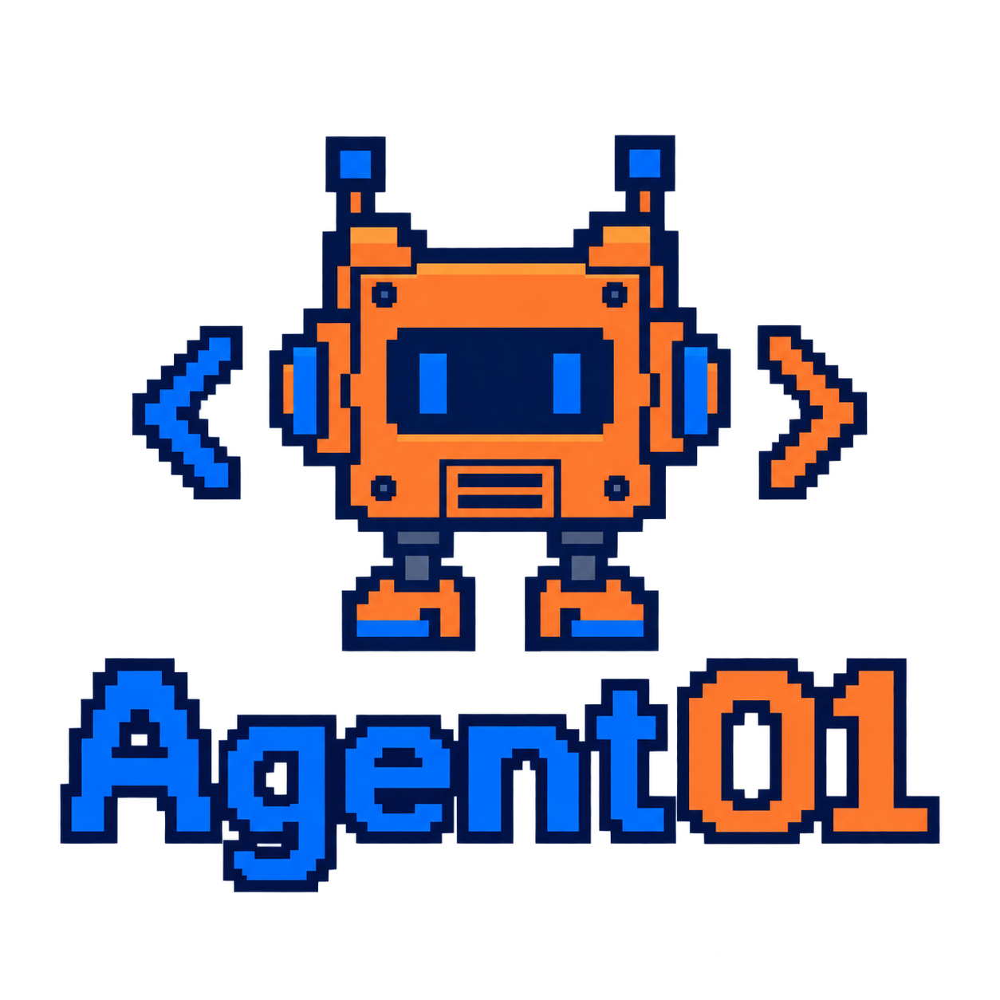

<p align="center">
  
</p>

<h1 align="center">Agent01 · From Scratch</h1>

<p align="center">逐文件阅读、重建一个 Agent，理解工具调用、任务调度与上下文管理。</p>

## TUI 阶段更新

已接入参考版本 `89c4ee4` 的 Textual 终端界面，使用本项目的 `logo.png`。运行：

```powershell
uv sync
uv run Agent01 tui
# 带初始任务打开界面
uv run Agent01 tui "你的任务"
# 普通终端输出模式仍可使用；选项放在任务文字之前
uv run Agent01 --trace-mode off "你的任务"
```

输入任务后按 Enter 开始，事件日志与右侧状态栏会持续更新；需要人工审批时弹出批准/拒绝窗口。Ctrl+L 清屏，Ctrl+Q 退出。当前版本运行中按 Ctrl+C 只显示提示，不会取消后台任务；退出后的恢复以已有 Checkpoint 为准。TUI 恢复需要同时提供初始任务和 `--resume` 路径，仅传路径不会自动启动。这一阶段连续提交的任务默认各用一个新工作区，尚未实现后续版本的多轮对话路由。

## Checkpoint / Trace 优化阶段

已同步参考版本 `45eab3c`：Checkpoint 在启动、节点更新、失败或需要审批的工具结果、中断和结束时保存，普通自定义事件只进入 Trace；轻量恢复会去除重复的恢复前缀；时间线保留前 40 条和最近 80 条，并标注中间省略的数量。`events.jsonl` 仍记录全部收到的事件（载荷保持原有截断规则）。

## Trace 阶段更新

已同步参考版本 `f92b8f0` 的运行链路记录。默认开启，可以通过 `--trace-mode off` 关闭：

```powershell
uv run Agent01 "你的任务" --trace-mode on
```

每次运行会在任务工作区的 `.Agent01/traces/<trace_id>/` 中记录 `events.jsonl`；正常完成或 Ctrl+C 中断后，生成统计文件 `summary.json` 和时间线 `timeline.md`。Trace 记录节点更新、工具调用和 Checkpoint 等事件，用于理解执行过程；恢复任务仍由 Checkpoint 负责。

程序接口未指定模式时读取 `AGENT_TRACE_MODE`。当前版本 CLI 默认传入 `on`，从命令行关闭请显式使用 `--trace-mode off`。

## Checkpoint 阶段更新

已接入参考版本 `340a3e3` 的进度保存和恢复功能。下方保留之前阶段的学习说明；工作区生命周期详见 [工作区说明](docs/workspace-lifecycle.md)。

```powershell
# 启动任务并保存摘要（默认 light）
uv run Agent01 "你的任务" --checkpoint-mode light
# 保存完整的可序列化状态和消息
uv run Agent01 "你的任务" --checkpoint-mode strict
# 使用之前输出的工作区路径恢复；strict 保存的任务建议显式选择 strict
uv run Agent01 --resume "原工作区路径" --checkpoint-mode strict
```

进度文件保存在任务工作区的 `.Agent01/checkpoints/` 下。`light` 保存摘要和恢复说明；`strict` 额外保存状态、消息和事件日志；`off` 关闭保存。Ctrl+C 中断会保存已收集的进度，恢复后重新运行工作流，并不是返回到中断的那一行代码。Git 快照用于记录文件版本，恢复命令不会自动回滚文件。

程序接口未指定模式时读取 `AGENT_CHECKPOINT_MODE`；此参考版本的 CLI 默认显式传入 `light`，因此从命令行切换模式请使用 `--checkpoint-mode`。

## 关于项目

Agent01 是我的 Agent 开发学习仓库，参考 MokioClaw 项目逐步重建，并在代码中记录理解与注释。“From Scratch”指从基础模块开始学习和组装；模型调用和工作流使用 LangChain、LangGraph 等现有框架。

**第三、四阶段学习记录：MultiAgent 专家分工 + Context Engineering 自动压缩。** 本阶段参考原项目提交 `7bd50cc`，该提交同时引入多 Agent 与上下文压缩。

| 阶段 | 学习内容 | 说明 |
| --- | --- | --- |
| 第一阶段 | `create_agent()` 单 Agent ReAct 工具循环 | [第一阶段存档](README_stage1.md) |
| 第二阶段 | LangGraph 规划、执行、命令验证与重试 | [第二阶段存档](README_stage2.md) |
| 第三、四阶段 | 调度专家 Agent、模型验收、上下文监控与压缩 | 当前 README |

历史 README 记录当时的实现与验证情况，其中的旧入口、功能说明不代表当前代码。

## 本阶段学到了什么

第二阶段由 planner 生成计划，再固定进入 actor 执行。本阶段 planner 成为 supervisor：通过工具调用搜索 Agent 和编程 Agent，接收结果后继续调度。原 actor 的编程执行循环被提取到 `agents/code_agent.py`。

验收也从“Python 逐条运行命令并检查退出码”升级为“模型使用工具检查产物并返回结构化结论”。工作流在 planner 和 verifier 返回后检查上下文大小，必要时调用模型生成摘要、替换旧消息，再继续原定节点。

这里的多个角色使用相同模型配置，但各有提示词、输入上下文和工具集合；它们不是多个独立部署的大模型。

## 工作流与角色

```text
用户任务
    ↓
planner / supervisor
    ├─ TodoWriteTool：制定或更新计划
    ├─ CallSearchAgentTool → searchAgent → 返回研究摘要与来源
    └─ CallCodeAgentTool   → codeAgent   → 返回实现摘要与 Todo
    ↓
context_monitor
    ├─ 达到阈值 → context_compressor → 原定下一节点
    └─ 未达到阈值 ───────────────────→ 原定下一节点

planner 后的下一节点：verifier
verifier 后再次经过 context_monitor：
    ├─ 验收失败且还有尝试次数 → planner
    └─ 验收通过或达到尝试上限 → final → 结束
```

搜索和编程 Agent 被包装成 planner 的工具，并不是外层图中固定依次执行的两个节点；当前调用循环按顺序执行模型提出的工具请求。

| 角色 / 节点 | 职责 | 主要能力 |
| --- | --- | --- |
| `planner` | 规划任务、委派专家、根据失败信息继续安排工作 | TodoWriteTool、CallSearchAgentTool、CallCodeAgentTool |
| `searchAgent` | 查找资料、汇总答案和来源 | Tavily WebSearchTool |
| `codeAgent` | 创建和编辑文件、运行命令、更新待办 | 文件工具、GrepTool、BashTool、TodoUpdateTool |
| `verifier` | 检查交付物，输出是否通过、检查项和修复建议 | FileReadTool、GrepTool、BashTool、WebSearchTool |
| `context_monitor` | 估算上下文大小，判断是否压缩 | token 估算与条件路由 |
| `context_compressor` | 生成恢复任务所需的摘要，缩减历史消息与部分状态 | 模型压缩、失败时的备用摘要 |
| `final` | 汇总计划、来源、验收、压缩和实现结果 | Python 拼接报告，不调用模型 |

## 如何运行

以下命令在项目根目录的 Windows PowerShell 中执行。需要 uv 和 Python 3.13 或以上版本；uv 安装方式见 [官方安装说明](https://docs.astral.sh/uv/getting-started/installation/)。

### 1. 安装依赖

```powershell
uv sync
```

依赖包括 LangChain、LangGraph、Tavily、Typer 等。`uv run` 会使用项目环境，不需要手动激活 `.venv`。

### 2. 配置模型和搜索服务

首次运行时复制模板；已经有 `.env` 时直接编辑原文件：

```powershell
Copy-Item .env.example .env
```

填写配置：

```dotenv
API_KEY=你的模型API密钥
MODEL=你的模型名称
BASE_URL=你的模型服务API基础地址
TAVILY_API_KEY=你的Tavily密钥
AGENT_CONTEXT_TOKEN_LIMIT=400000
```

| 配置 | 用途 |
| --- | --- |
| `API_KEY` | 模型服务密钥，创建模型时必需 |
| `MODEL` | 模型名称，创建模型时必需 |
| `BASE_URL` | 模型 API 基础地址，创建模型时必需 |
| `TAVILY_API_KEY` | 搜索工具使用的 Tavily 密钥，联网搜索任务需要配置 |
| `AGENT_CONTEXT_TOKEN_LIMIT` | 自动压缩阈值，未配置或配置无效时默认 `400000` |

模型通过 `ChatOpenAI` 调用，需要兼容的接口和支持工具调用的模型。`BASE_URL` 不是聊天网页地址。模型密钥与 Tavily 密钥来自各自服务，不能互相替代；`.env` 已被 Git 忽略。

### 3. 检查入口

```powershell
uv run Agent01 --help
```

不传任务时也会显示帮助，这一步不调用模型。

### 4. 运行任务

先尝试一个简单编码任务：

```powershell
uv run Agent01 "创建 hello.py，输出 Hello, Agent01!，并运行它检查结果。"
```

本阶段的多 Agent 演示任务：

```powershell
uv run Agent01 "帮我查阅明日方舟阿米娅，并编写一个 HTML 介绍人物，包含至少两个资料来源链接。"
```

可以观察 planner 委派搜索、编程 Agent 返回结果以及 verifier 使用工具检查的过程。模型具体调用次序取决于任务和模型输出，执行成功与否应以实际运行结果为准。

默认文件输出目录为 `.Agent01/workspace/`，不同任务仍会重复使用这个目录。也可以指定工作区：

```powershell
uv run Agent01 "查阅阿米娅的资料并创建介绍网页。" --workspace ./demo-amiya --max-attempts 3
```

| 参数 | 默认值 | 作用 |
| --- | --- | --- |
| `TASK` | 无 | 自然语言任务 |
| `--workspace` / `-w` | `.Agent01/workspace/` | 文件操作与命令执行的工作区 |
| `--max-attempts` | `3` | 验收轮次上限，验收通过时提前结束 |

`--max-attempts` 不是模型请求次数。单次节点或子 Agent 内部还可能多轮调用模型和工具。

其他启动方式：

```powershell
uv run main.py "你的任务"
uv run python -m Agent01 "你的任务"
```

### 5. 观察自动压缩

为了演示，可以临时降低当前终端的阈值：

```powershell
$env:AGENT_CONTEXT_TOKEN_LIMIT = "2000"
uv run Agent01 "查阅阿米娅的资料并生成包含来源链接的介绍网页。"
Remove-Item Env:AGENT_CONTEXT_TOKEN_LIMIT
```

终端会展示上下文估算、是否触发压缩，以及压缩前后的估算值。`2000` 仅用于演示，正常使用应按实际模型的上下文容量选择阈值并预留输出空间。

## 上下文压缩如何工作

监控节点估算图消息和相关状态的 token 数量；估算失败时使用文本长度作为粗略替代。达到阈值后，压缩节点整理任务、计划、Todo、研究结果、来源、实现摘要、验收信息与下一步，交给模型生成结构化摘要；调用或解析失败时使用备用摘要逻辑。

压缩不是单纯追加总结。节点通过以下消息更新删除旧历史，再写入摘要：

```python
"messages": [RemoveMessage(id=REMOVE_ALL_MESSAGES), summary_message]
```

同时更新 `context_summary`，截短部分状态文本和交接记录。后续 planner、verifier 的输入会带上摘要。

该机制在外层节点之间运行，不会在子 Agent 每次模型调用前自动检查；压缩阈值和 token 估算也不保证一定避免模型窗口超限。压缩会丢失细节，需要结合实际任务观察效果。

## 状态与事件

- `RuntimeState`：工作区路径、文件读取记录与快照。
- `Agent01GraphState`：任务、消息、计划、Todo、研究来源、交接记录、验收和压缩信息，其中 `runtime` 引用 `RuntimeState`。

节点返回的字典由 LangGraph 合并进状态。子 Agent 返回结果，由 planner 的工具包装函数挑选摘要、来源、Todo 等写回工作状态；各角色并不自动共享全部对话。

`writer` 是外层传入的事件发送函数。子 Agent 调用 `writer({...})` 报告工具调用、搜索结果或交接信息，LangGraph 通过 `custom` 流传出；节点状态更新则通过 `updates` 流传出。`core/agent.py` 转发两类事件，CLI 使用 Rich 面板和表格展示。

## 代码结构与阅读顺序

```text
src/Agent01/
├─ agents/
│  ├─ search_agent.py       # 搜索 Agent 的模型与工具循环
│  └─ code_agent.py         # 编程 Agent 的模型与工具循环
├─ graph/
│  ├─ state.py              # 工作流共享状态
│  ├─ nodes.py              # 调度、验收、监控、压缩与汇总
│  └─ workflow.py           # 节点连接与条件路由
├─ tools/
│  ├─ web_search_tool.py    # Tavily 搜索
│  ├─ registry.py           # 编程与验收工具集合
│  ├─ todo_tool.py          # Todo 数据整理与更新
│  ├─ file_tools.py         # 文件读写与编辑
│  ├─ grep_tool.py          # 文件内容搜索
│  └─ bash_tool.py          # 命令执行与平台相关工具说明
├─ prompts/
│  ├─ version1.py           # 第一阶段提示词存档
│  ├─ version2.py           # 第二阶段提示词存档
│  ├─ version3.py           # 调度、搜索、编程和验收提示词
│  └─ version4.py           # 压缩提示词
├─ core/
│  ├─ agent.py              # 初始化、启动工作流、转发事件
│  ├─ paths.py              # 根目录与工作区路径
│  └─ state.py              # RuntimeState
├─ providers/openai_provider.py
├─ cli/
│  ├─ app.py                # 命令行入口
│  └─ formatter.py          # 事件展示
└─ __main__.py              # 模块启动入口
```

建议从 `graph/state.py` 和搜索工具开始，接着读 `version3.py`、两个子 Agent，再读 `nodes.py` 的 planner 和 verifier。最后学习 `version4.py` 与压缩相关函数，连接 `workflow.py`，理解 CLI 如何展示事件。

## 当前边界与验证记录

本阶段仍以学习和演示为目的：

- Todo 保存在运行状态中，尚未引入 `TODO.md`、长期笔记、checkpoint 或任务恢复。
- 默认工作区仍是固定目录，不会为每个任务自动新建目录。
- 阿米娅演示保留了特定的默认计划和验证命令，这些不是通用 Agent 的必要组成部分。
- verifier 的工具集合虽然名为 `build_read_only_tools()`，仍含命令执行能力。提示词中的只读约束不是系统级隔离；命令在本机执行。
- 模型验收依赖模型判断和工具结果，不等于对所有任务提供正确性保证。

本次阶段整理时，针对当前源码运行了适配包名及环境变量名的原项目参考测试：**44 项通过**；`python -m Agent01 --help` 入口检查通过。本次测试没有使用临时导出补丁，缺失的工具导出已在源码中修复。

参考测试在仓库外临时运行，尚未纳入本仓库，因此新下载的仓库不能直接据此运行这 44 项测试。此次没有进行真实模型与 Tavily 服务的端到端任务验证，以上结果也不代表后续修改自动通过。
