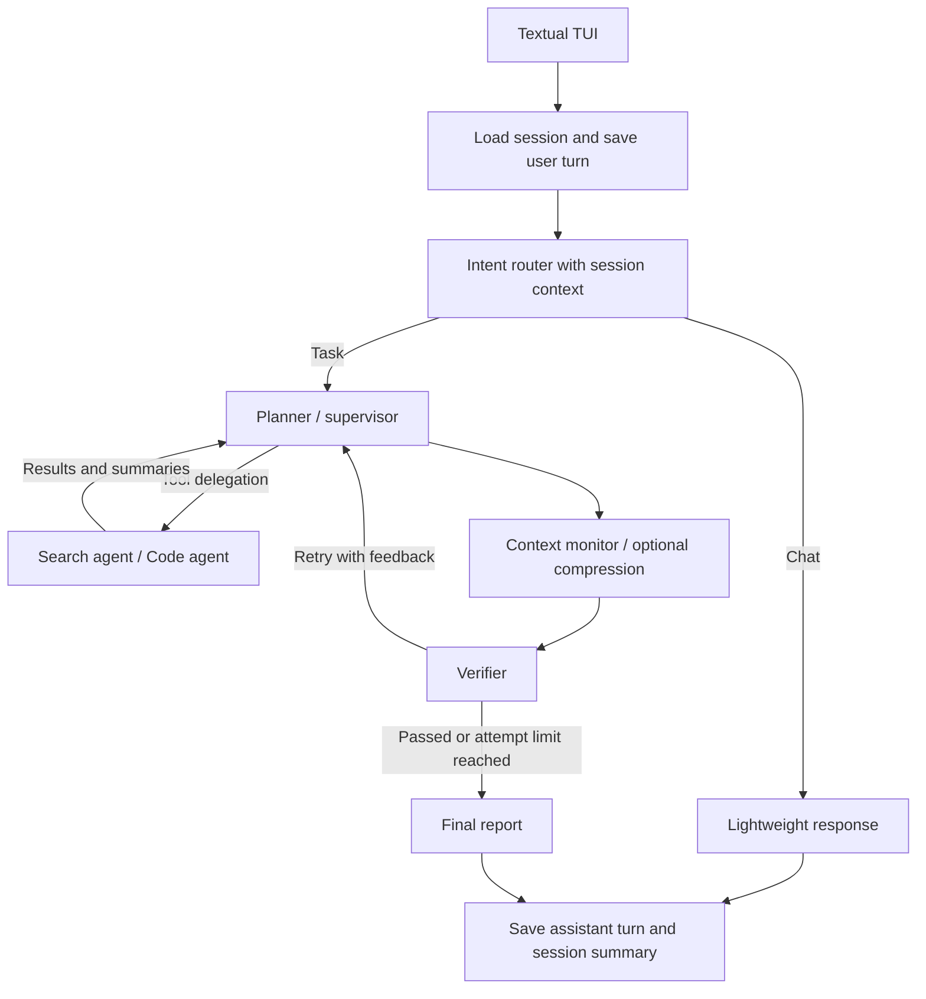

<p align="center">
  
</p>

<h1 align="center">Agent01</h1>
<p align="center"><strong>A terminal coding assistant with multi-agent workflows, persistent sessions, and inspectable execution.</strong></p>
<p align="center">Python · LangGraph · LangChain · Textual</p>
<p align="center">English | <a href="./README_zh-CN.md">简体中文</a></p>

Agent01 turns natural-language requests into a plan, delegates research and implementation to specialist agents, and checks the result through a verification loop. A terminal interface brings together ongoing conversations, tool activity, approval decisions, and execution records.

## Highlights

- **Intent-aware execution.** A model-based router separates conversational requests from tasks that need files, commands, web research, or a concrete deliverable. Uncertain classifications fall back to the task workflow.
- **Multi-agent orchestration.** A planner delegates to search and coding agents through tool calls. A verifier inspects results and feeds failures back into the planning loop, subject to an attempt limit.
- **Persistent coding sessions.** TUI turns share a workspace and a saved conversation context, so follow-up requests can build on earlier work. `/new` starts a separate session.
- **Context and memory management.** Working state, TODOs, notes, history summaries, and session context inform subsequent model calls. Context monitoring can trigger message compression between workflow nodes.
- **Human approval and command controls.** Commands matching configured risk patterns can require approval. Command execution supports timeouts, output truncation with full logs, and background processes.
- **Checkpoint recovery and trace logs.** Save task summaries, optional serialized state, and workspace Git snapshots; inspect event logs, execution statistics, and a timeline.
- **Interactive terminal UI.** Collapsible event cards, a session sidebar, approval dialogs, and a worker thread keep execution visible while the interface processes user interactions.

## Example session

Start the TUI and send requests such as:

```text
Create a personal portfolio page with an about section and project cards.
Change the theme to dark blue and improve the mobile layout.
Run checks and explain what you verified.
```

These are example prompts, not a recorded benchmark. Each turn uses the same session workspace; the router receives recent conversation context to interpret follow-ups.

## Architecture


```mermaid
flowchart TD
    UI[Textual TUI] --> S[Load session and save user turn]
    S --> R[Intent router with session context]
    R -->|Chat| C[Lightweight response]
    R -->|Task| P[Planner / supervisor]
    P -->|Tool delegation| A[Search agent / Code agent]
    A -->|Results and summaries| P
    P --> M[Context monitor / optional compression]
    M --> V[Verifier]
    V -->|Retry with feedback| P
    V -->|Passed or attempt limit reached| F[Final report]
    C --> D[Save assistant turn and session summary]
    F --> D
```

The diagram summarizes the control flow. In the implementation, context monitoring also runs after verification. Specialist agents are tools invoked by the planner, rather than fixed sequential graph nodes. They use separate prompts and tool sets with the configured model service.

Two entry points share the underlying task graph:

| Entry point | Behavior |
| --- | --- |
| `stream_agent_events()` | Single-request CLI flow; task execution normally receives a fresh workspace unless one is supplied. |
| `stream_session_events()` | TUI flow; reloads session records, supplies history to model inputs, and reuses a workspace across turns. |

Graph updates carry state changes; custom events report tool activity, routing decisions, checkpoints, and session progress. The UI consumes these events without owning the agent's execution logic.

## Quick start

Requirements: **Python 3.13+**, **uv**, an OpenAI-compatible model endpoint with tool-call support, and Git for workspace snapshots. Web-search tasks also need a Tavily API key.

Run the following from the repository root. The examples use PowerShell.

```powershell
uv sync
# First-time setup only; keep an existing .env if you already configured it.
Copy-Item .env.example .env
```

Edit `.env`:

```dotenv
API_KEY=your-model-api-key
MODEL=your-model-name
BASE_URL=https://your-provider.example/v1
TAVILY_API_KEY=your-tavily-api-key
```

`BASE_URL` is the API endpoint, not a chat website URL. Set the context threshold in `.env.example` to suit your chosen model; its default is not a statement about the model's actual context capacity.

```powershell
# Open an interactive session
uv run Agent01 tui

# Reuse a known session workspace, including after restarting the app
uv run Agent01 tui --workspace ./demo-workspace

# Run a single task with standard terminal output
uv run Agent01 --workspace ./demo-workspace "Create hello.py and run it to check its output."

# Inspect available options without calling a model
uv run Agent01 --help
uv run Agent01 tui --help
```

For the single-task CLI, place options **before** the task text. Ordinary CLI requests do not automatically use TUI conversation history.

### Session controls

| Action | Effect |
| --- | --- |
| Enter | Submit the current message. |
| `/new` | Select a fresh session workspace; keep the previous files. |
| Ctrl+L | Clear visible cards without deleting saved history. |
| Ctrl+Q | Exit the TUI. |
| Approval dialog | Approve or reject a command flagged by the risk rules. |

In this version, Ctrl+C while a TUI task is active displays a notice rather than cancelling the worker. An exit is not a guarantee that an additional checkpoint has been written.

### Execution options

| Option | Default | Purpose |
| --- | --- | --- |
| `--workspace`, `-w` | Generated workspace | Select task or session files. |
| `--max-attempts` | `3` | Bound verification attempts, not total model calls. |
| `--approval-mode` | `inline` | `inline`, `auto`, or `deny` for commands flagged by risk rules. |
| `--checkpoint-mode` | `light` | `light`, `strict`, or `off`. |
| `--trace-mode` | `on` | Enable or disable workflow traces. |
| `--resume` | Unset | Load task recovery information from an existing workspace. |

Additional `.env.example` settings cover context limits, command timeouts, output limits, and a workspace environment file. CLI mode defaults are passed explicitly; use the corresponding CLI options to change them.

## Persistence and recovery

Default generated workspaces live under `.Agent01/workspaces/workspace-*`. Inside a session workspace, files are created as the corresponding features run:

```text
workspace/
├── project files...
├── TODO.md
├── NOTEPAD.md
├── HISTORY_SUMMARY.md
├── SESSION_SUMMARY.md
└── .Agent01/
    ├── session/session.json
    ├── checkpoints/
    │   ├── checkpoint.json
    │   ├── RECOVERY.md
    │   ├── git/
    │   ├── state.json          # strict mode
    │   └── events.jsonl        # strict checkpoint events
    └── traces/<trace-id>/
        ├── events.jsonl
        ├── summary.json
        └── timeline.md
```

**Sessions** preserve conversation records and compacted summaries. The model receives a bounded context assembled from these records on each turn; it does not automatically remember previous API calls. Older text is summarized through record aggregation and truncation, so this is not an unlimited transcript archive.

**Checkpoints** preserve task progress. `light` saves recovery summaries and workspace versions; `strict` additionally serializes graph state and messages. Recovery reconstructs inputs and restarts the workflow—it does not restore a Python stack or automatically roll files back.

```powershell
# Recover a task using the standard CLI
uv run Agent01 --resume ./demo-workspace --checkpoint-mode strict
```

Use the mode appropriate to the saved checkpoint; strict recovery falls back to light recovery if serialized state cannot be loaded. Continuing a conversation with `tui --workspace` is distinct from restoring a task checkpoint. TUI checkpoint recovery currently requires an initial task as well as `--resume` and still passes through intent classification.

**Traces** record the complex workflow's received events and produce statistics and a timeline. Chat-only session turns save conversation data without creating workflow checkpoints or traces. Payloads and displayed timelines have size limits.

## Code map

```text
src/Agent01/
├── agents/       # Search and coding agent loops
├── graph/        # Typed state, routing, planning, verification, memory
├── core/         # Runtime, sessions, approvals, checkpoints, traces
├── tools/        # File operations, search, commands, TODOs, notes
├── providers/    # Model client configuration
├── prompts/      # Role and context-compression prompts
└── cli/          # Typer entry point, event presentation, Textual TUI
```

Useful starting points: [session execution](src/Agent01/core/agent.py), [workflow graph](src/Agent01/graph/workflow.py), [agent nodes](src/Agent01/graph/nodes.py), [session storage](src/Agent01/core/session.py), and [TUI](src/Agent01/cli/tui/app.py). The code includes Chinese explanations of key control flow and Python constructs.

## Validation

```powershell
uv sync --group dev
uv run pytest tests -q
```

The test suite covers routing, runtime configuration, session persistence, checkpoint recovery, trace records, event formatting, and headless TUI interactions. Model-facing workflow tests use substitutes; they do not establish the accuracy or reliability of a live model on arbitrary coding tasks.

Commands execute on the host machine. Workspace checks and approval rules provide application-level controls, not operating-system isolation. Verification results depend on the checks performed and the model's interpretation.

## Project notes

Development history is archived separately: [Stage 1](README_stage1.md), [Stage 2](README_stage2.md), and [Stages 3 onward](README_stage3.md). These retain the implementation notes and references from each phase; their historical commands and feature descriptions may differ from the current version.

## License

[MIT](LICENSE).
