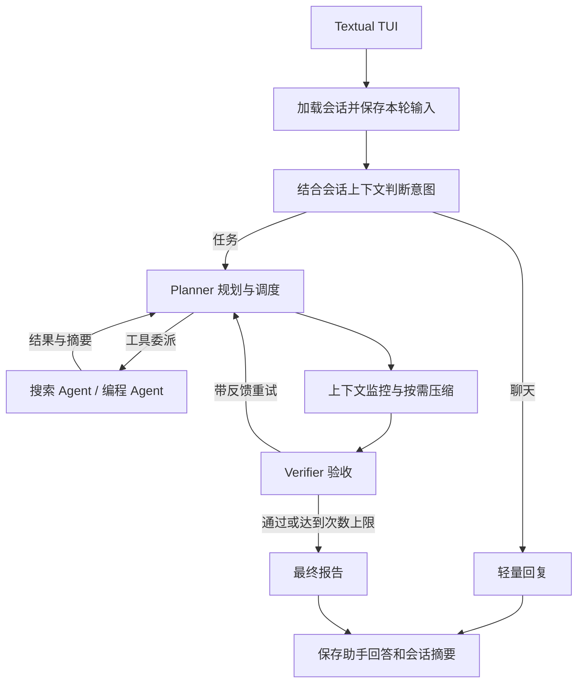

<p align="center">
  
</p>

<h1 align="center">Agent01</h1>
<p align="center"><strong>集多 Agent 工作流、持久会话和执行追踪于一体的终端编程助手。</strong></p>
<p align="center">Python · LangGraph · LangChain · Textual</p>
<p align="center"><a href="./README.md">English</a> | 简体中文</p>

Agent01 将自然语言需求转为计划，通过工具调用委派搜索与编程 Agent，并使用验收循环检查结果。终端界面统一展示连续对话、工具活动、审批决定和执行记录，让任务从输入到交付的过程可以查看和追踪。

## 项目特色

- **意图路由**：区分普通对话与需要文件、命令、搜索或具体交付物的任务；分类不确定时回退到任务工作流。
- **多 Agent 调度**：Planner 通过工具委派搜索和编程角色，Verifier 检查产物并将失败反馈给规划环节，在尝试次数限制内迭代。
- **持久编程会话**：同一 TUI 会话复用工作区，并将历史上下文传给后续模型调用；使用 `/new` 切换到独立会话。
- **上下文与记忆管理**：结合工作状态、TODO、笔记、历史摘要和会话上下文；在图节点之间监控上下文大小并按需压缩消息。
- **人工审批与命令控制**：匹配风险规则的命令可要求人工审批；支持超时、输出截断与完整日志、后台进程。
- **进度恢复与执行追踪**：保存任务摘要、可选的序列化状态和工作区 Git 快照；提供事件日志、统计摘要和执行时间线。
- **交互式终端界面**：可折叠事件卡片、会话侧栏、审批弹窗与后台工作线程，方便观察任务执行并与界面交互。

## 使用示例

打开 TUI 后，可以连续输入：

```text
创建一个个人作品集页面，包含自我介绍和项目卡片。
把主题改成深蓝色，优化手机上的布局。
运行检查，并说明验证了哪些内容。
```

以上是示例提示词，不是性能评测记录。每轮使用同一个会话工作区，分类器通过近期对话理解后续请求。

## 系统架构



上图概括控制流程；实际实现中，验收节点之后也会进行上下文监控。专家 Agent 以 Planner 工具的形式调用，不是外层图中固定依次执行的节点。不同角色使用各自的提示词和工具集合，连接配置的模型服务。

| 入口 | 行为 |
| --- | --- |
| `stream_agent_events()` | 普通 CLI 的单次请求；未指定工作区时，任务执行通常创建新目录。 |
| `stream_session_events()` | TUI 的会话入口；加载记录、向模型提供历史，多轮复用工作区。 |

图更新负责传递状态变化，自定义事件负责报告工具活动、路由结果、Checkpoint 和会话进度。界面消费这些事件，Agent 执行逻辑与界面展示分离。

## 快速开始

需要 **Python 3.13+**、**uv**、支持工具调用的 OpenAI 兼容模型接口，以及用于工作区快照的 Git。联网搜索任务还需要 Tavily API Key。

在项目根目录执行以下 PowerShell 命令：

```powershell
uv sync
# 仅首次配置时复制；已有 .env 时保留并编辑原文件。
Copy-Item .env.example .env
```

编辑 `.env`：

```dotenv
API_KEY=你的模型服务密钥
MODEL=你的模型名称
BASE_URL=https://your-provider.example/v1
TAVILY_API_KEY=你的Tavily密钥
```

`BASE_URL` 是 API 基础地址，不是聊天网页。请按所用模型调整 `.env.example` 中的上下文阈值，默认值不代表模型实际支持的上下文容量。

```powershell
# 打开交互式会话
uv run Agent01 tui

# 指定会话工作区；重启后可通过原路径继续会话
uv run Agent01 tui --workspace ./demo-workspace

# 普通终端模式执行一次任务
uv run Agent01 --workspace ./demo-workspace "创建 hello.py 并运行检查输出。"

# 查看参数，不调用模型
uv run Agent01 --help
uv run Agent01 tui --help
```

普通 CLI 的选项放在任务文字之前；普通请求不会自动使用 TUI 的对话历史。

### 会话操作

| 操作 | 效果 |
| --- | --- |
| Enter | 发送当前输入。 |
| `/new` | 选择新的会话工作区，保留旧文件。 |
| Ctrl+L | 清空可见卡片，不删除历史记录。 |
| Ctrl+Q | 退出 TUI。 |
| 审批弹窗 | 批准或拒绝被风险规则标记的命令。 |

当前版本在 TUI 任务运行中按 Ctrl+C 只会显示提示，不会取消工作线程；退出也不保证额外写入一次 Checkpoint。

### 运行选项

| 参数 | 默认值 | 用途 |
| --- | --- | --- |
| `--workspace` / `-w` | 自动生成 | 指定任务或会话的工作区。 |
| `--max-attempts` | `3` | 限制验收尝试次数，不是模型调用总次数。 |
| `--approval-mode` | `inline` | 对被规则标记的命令使用 `inline`、`auto` 或 `deny`。 |
| `--checkpoint-mode` | `light` | `light`、`strict` 或 `off`。 |
| `--trace-mode` | `on` | 开启或关闭任务 Trace。 |
| `--resume` | 未设置 | 从已有工作区读取任务恢复信息。 |

`.env.example` 还提供上下文阈值、命令超时、输出长度及工作区环境文件配置。CLI 会显式传入模式默认值，切换模式请使用对应命令行选项。

## 持久化与恢复

默认工作区位于 `.Agent01/workspaces/workspace-*`。各项功能运行后，在会话工作区中生成对应文件：

```text
工作区/
├── 项目文件...
├── TODO.md
├── NOTEPAD.md
├── HISTORY_SUMMARY.md
├── SESSION_SUMMARY.md
└── .Agent01/
    ├── session/session.json
    ├── checkpoints/
    │   ├── checkpoint.json
    │   ├── RECOVERY.md
    │   ├── git/
    │   ├── state.json          # strict 模式
    │   └── events.jsonl        # strict 保存点事件
    └── traces/<trace-id>/
        ├── events.jsonl
        ├── summary.json
        └── timeline.md
```

**Session** 保存对话记录和整理后的摘要。每轮从中构建有限长度的上下文重新传给模型，模型不会自动记住之前的 API 调用。较旧记录通过聚合与截断整理，不是无限保留完整聊天记录。

**Checkpoint** 保存任务进度。`light` 保存恢复摘要和工作区版本；`strict` 额外保存图状态与消息。恢复过程是重建输入并重新运行工作流，不恢复 Python 调用栈，也不自动回滚文件。

```powershell
# 使用普通 CLI 恢复任务
uv run Agent01 --resume ./demo-workspace --checkpoint-mode strict
```

根据原保存方式选择模式；strict 状态无法读取时会回退到 light。`tui --workspace` 继续对话与恢复任务 Checkpoint 是不同操作。当前 TUI 的 Checkpoint 恢复需要初始任务和 `--resume`，且仍先经过意图分类。

**Trace** 记录复杂工作流接收到的事件，并生成统计信息与时间线。纯聊天轮次保存会话记录，不创建任务 Checkpoint 或 Trace；事件载荷和显示时间线均有大小限制。

## 代码结构

```text
src/Agent01/
├── agents/       # 搜索与编程 Agent 循环
├── graph/        # 类型化状态、路由、规划、验收、记忆
├── core/         # 运行环境、会话、审批、Checkpoint、Trace
├── tools/        # 文件操作、搜索、命令、TODO 和笔记
├── providers/    # 模型客户端配置
├── prompts/      # 角色提示词与上下文压缩提示词
└── cli/          # Typer 入口、事件显示与 Textual TUI
```

建议从[会话执行入口](src/Agent01/core/agent.py)、[工作流图](src/Agent01/graph/workflow.py)、[Agent 节点](src/Agent01/graph/nodes.py)、[会话存储](src/Agent01/core/session.py)和 [TUI](src/Agent01/cli/tui/app.py)开始阅读。代码包含关键控制流程及 Python 用法的中文注释。

## 验证

```powershell
uv sync --group dev
uv run pytest tests -q
```

测试覆盖意图路由、运行配置、会话持久化、Checkpoint 恢复、Trace 记录、事件格式化和无界面的 TUI 交互。涉及模型的工作流测试使用替代实现，不代表真实模型对任意编码任务的准确率或稳定性。

命令在本机运行。工作区检查与审批规则是应用层控制，不是操作系统级隔离。验收结论取决于实际执行的检查以及模型对结果的判断。

## 开发记录

阶段文档独立归档：[第一阶段](README_stage1.md)、[第二阶段](README_stage2.md)、[第三阶段及后续演进](README_stage3.md)。归档保留当时的实现笔记和参考信息，历史命令与功能说明可能与当前版本不同。

## 许可证

[MIT](LICENSE)。
